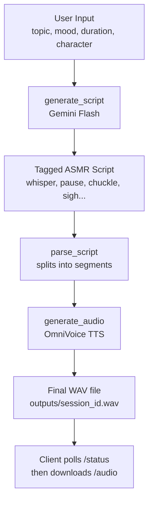

# 🦊 ASMR Bot — AI ASMR Roleplay Platform

An AI-powered ASMR roleplay generator. Give it a **topic**, a **mood**, and a **duration**, and it writes a fully-tagged ASMR script in character, then synthesizes it into immersive spoken audio — complete with whispers, sighs, soft laughs, and natural pauses.

The MVP ships with **Yae Miko** (Genshin Impact) as the first character voice, built on a voice-cloning + voice-design TTS pipeline that is easy to extend with new characters.

---

## ✨ Features

- **Two-stage generation pipeline** — an LLM (Gemini, free tier) writes the ASMR script with embedded emotion/sound tags, then [OmniVoice](https://github.com/k2-fsa/OmniVoice) converts it to natural speech.
- **Tag-driven delivery** — `[whisper]`, `[soft]`, `[pause:N]`, `[chuckle]`, `[sigh]`, `[breathe]`, `[hm]` are parsed automatically and mapped to TTS parameters (voice design, speed, silence, non-verbal sounds).
- **Character voice cloning** — each character is defined by a short reference audio clip + reference transcript, which OmniVoice uses to clone the voice without any fine-tuning.
- **Async job pipeline** — script generation is near-instant; audio generation runs in the background while the client polls for status, so the UI never blocks.
- **Simple web UI** — a static HTML frontend served directly by FastAPI, no separate frontend build required.
- **100% free-tier friendly** — Gemini Flash free tier for scripting, OmniVoice (open-source, self-hosted) for TTS. No paid APIs required for the MVP.

---

## 🧠 How It Works



1. **Script generation** (`generate_script`) — sends the topic, mood, target duration, and the selected character's personality profile to Gemini, along with a tag guide. Gemini returns a script written entirely in character, annotated with delivery tags.
2. **Script parsing** (`parse_script`) — walks through the tagged script and breaks it into an ordered list of segments: `speech` (normal / whisper / soft), `sound` (non-verbal cues like laughter or sighs), and `pause` (silence of N seconds).
3. **Audio synthesis** (`generate_audio`) — for each segment, calls OmniVoice with the appropriate mode:
   - **Normal/soft speech** → voice cloning using the character's reference audio + reference text, with adjusted speed.
   - **Whisper speech** → OmniVoice's built-in *Voice Design* mode (`instruct="female, high pitch, whisper"`), no reference audio needed.
   - **Sounds** (`[laughter]`, `[sigh]`, etc.) → OmniVoice's non-verbal tokens, cloned in the character's voice.
   - **Pauses** → raw silence (`numpy.zeros`) inserted directly into the audio buffer.
4. All segments are concatenated with short gaps, normalized to a safe peak volume, and written out as a 24kHz mono WAV file.

---

## 🛠️ Tech Stack

| Layer | Technology |
|---|---|
| Backend framework | [FastAPI](https://fastapi.tiangolo.com/) + [Uvicorn](https://www.uvicorn.org/) |
| Script generation | [Gemini API](https://ai.google.dev/) (`google-genai`) — free tier |
| Text-to-speech | [OmniVoice](https://github.com/k2-fsa/OmniVoice) (voice cloning + voice design) |
| Audio processing | NumPy, SoundFile |
| ML runtime | PyTorch + Torchaudio (CUDA optional, CPU fallback) |
| Frontend | Static HTML/CSS/JS served from `/static` |
| Package management | [uv](https://docs.astral.sh/uv/) |

---

## 📁 Project Structure

```
asmrbot/
├── main.py            # uv project entry stub (unused by the app)
├── server.py          # FastAPI app — routes, job queue, startup logic
├── generate.py         # Core logic: script generation, parsing, TTS
├── pyproject.toml      # Project dependencies (managed by uv)
├── uv.lock             # Locked dependency versions
├── .python-version     # Pinned Python version (>=3.12)
├── static/
│   └── index.html      # Web UI (served at GET /)
├── voices/
│   └── yae_miko_ref.wav  # Reference audio clip for voice cloning
└── outputs/
    └── <session_id>.wav  # Generated ASMR audio files
```

---

## ⚙️ Prerequisites

- **Python 3.12+**
- **[uv](https://docs.astral.sh/uv/getting-started/installation/)** for dependency management
- **A free Gemini API key** — get one at [aistudio.google.com](https://aistudio.google.com/)
- **(Recommended) NVIDIA GPU with CUDA** — OmniVoice runs on CPU but is significantly faster on GPU. ~8GB VRAM recommended.
- **~3GB free disk space** for the OmniVoice model weights (downloaded automatically on first run from Hugging Face).

---

## 🚀 Setup & Installation

### 1. Clone the repository

```bash
git clone https://github.com/Shissors/asmrbot.git
cd asmrbot
```

### 2. Install dependencies with uv

```bash
uv sync
```

This creates a virtual environment and installs every dependency pinned in `uv.lock` (FastAPI, OmniVoice, PyTorch, etc.).

> **GPU users:** if `uv sync` installs a CPU-only build of PyTorch and you have an NVIDIA GPU, reinstall the CUDA build manually:
> ```bash
> uv pip install torch torchaudio --index-url https://download.pytorch.org/whl/cu128
> ```

### 3. Set up your environment variables

Create a `.env` file in the project root:

```env
GEMINI_API_KEY=your_gemini_api_key_here
```

### 4. Add a reference voice clip

Place a clean 5–10 second WAV clip of Yae Miko's voice at:

```
voices/yae_miko_ref.wav
```

The clip should contain a single clear voice with no background music. This is used by OmniVoice for zero-shot voice cloning. The corresponding transcript is already configured in `generate.py` under `CHARACTERS["yae_miko"]["ref_text"]` — if you use a different clip, update `ref_text` to match what's actually said in your clip.

### 5. (Optional) Redirect the Hugging Face cache

OmniVoice downloads ~2–3GB of model weights from Hugging Face on first run. If your default drive is low on space (especially on Windows `C:`), set these **before** running the server:

```bash
# Windows (PowerShell)
$env:HF_HOME = "D:/huggingface_cache"
$env:HUGGINGFACE_HUB_CACHE = "D:/huggingface_cache"

# macOS/Linux
export HF_HOME=/path/to/larger/drive/huggingface_cache
export HUGGINGFACE_HUB_CACHE=/path/to/larger/drive/huggingface_cache
```

---

## ▶️ Running the Server

```bash
uv run uvicorn server:app --reload --port 8000
```

On startup, the server loads the OmniVoice model (`load_omnivoice()`), which can take ~30 seconds on the first run (or longer the very first time, while weights download).

Once ready, open your browser to:

```
http://localhost:8000
```

This serves `static/index.html`, the built-in web UI.

---

## 📡 API Reference

### `GET /`
Serves the web UI (`static/index.html`).

### `GET /characters`
Returns the list of available characters for the UI's character selector.

**Response:**
```json
[
  { "id": "yae_miko", "name": "Yae Miko" }
]
```

### `POST /generate`
Starts a new ASMR generation job. Returns immediately with the generated script while audio renders in the background.

**Request body:**
```json
{
  "topic": "Yae Miko reads you a fox folklore story by candlelight",
  "mood": "calming and soothing",
  "duration": 120,
  "character": "yae_miko",
  "speed": 0.88
}
```

| Field | Type | Default | Notes |
|---|---|---|---|
| `topic` | string | — | Required. The scenario/topic for the script. |
| `mood` | string | `"calming and soothing"` | Sets the emotional tone of the script. |
| `duration` | int | `120` | Target length in **seconds**. Must be between 10 and 600. |
| `character` | string | `"yae_miko"` | Must match a key in `CHARACTERS`. |
| `speed` | float | `0.88` | Base TTS playback speed (1.0 = normal). |

**Response:**
```json
{
  "session_id": "f3a1c9e2-...",
  "script": "...full tagged script text...",
  "status": "generating"
}
```

### `GET /status/{session_id}`
Poll this endpoint to check whether audio generation has finished.

**Response:**
```json
{ "status": "generating" }
```
`status` is one of: `"generating"`, `"ready"`, `"error"`. If `"error"`, an `error` field with details is included.

### `GET /audio/{session_id}`
Downloads the finished WAV file once `status == "ready"`. Returns HTTP `425 Too Early` if called before the audio is ready.

---

## 🏷️ ASMR Tag System

The LLM is instructed to embed the following tags directly into the script. `parse_script()` converts these into TTS instructions:

| Tag | Effect |
|---|---|
| `[whisper]...[/whisper]` | Switches to OmniVoice Voice Design whisper mode — breathy, intimate delivery |
| `[soft]...[/soft]` | Slightly quieter, slower normal speech |
| `[pause:N]` | Inserts `N` seconds of silence (e.g. `[pause:2]`) |
| `[chuckle]` | Soft laugh, rendered via OmniVoice's `[laughter]` non-verbal token |
| `[sigh]` / `[breathe]` | Gentle sigh/breath, rendered via OmniVoice's `[sigh]` token |
| `[hm]` | Thoughtful hum, rendered via OmniVoice's `[confirmation-en]` token |

---

## 🎭 Character System

Characters are defined in `generate.py` inside the `CHARACTERS` dictionary. Each entry contains:

```python
CHARACTERS = {
    "character_id": {
        "name": "Display Name",
        "ref_audio": "voices/character_ref.wav",   # 5-10s clean voice clip
        "ref_text": "Exact transcript of ref_audio",
        "personality": "Prompt text describing speech style, used in script generation",
        "whisper_instruct": "female, high pitch, whisper",  # OmniVoice Voice Design string for whispers
    },
}
```

### Adding a new character

1. Record or source a clean 5–10 second voice clip and place it in `voices/`.
2. Add a new entry to `CHARACTERS` with the clip path, exact transcript, and a personality prompt describing tone, vocabulary, and speech quirks.
3. Set an appropriate `whisper_instruct` string. Valid OmniVoice Voice Design keywords include combinations of: `male`/`female`, pitch (`low pitch`, `high pitch`, `very high pitch`, etc.), age (`child`, `teenager`, `young adult`, `middle-aged`, `elderly`), accents, and `whisper`.
4. The character will automatically appear in `GET /characters` and become selectable via the `character` field in `/generate`.

---

## ⚠️ Known Issues & Troubleshooting

- **`gemini-3.5-flash` model name** — `generate.py` currently calls `client.models.generate_content(model="gemini-3.5-flash", ...)`. Verify this against the [current list of available Gemini models](https://ai.google.dev/gemini-api/docs/models) for your API key — free-tier flash models are renamed periodically (e.g. `gemini-1.5-flash`, `gemini-2.5-flash`). Update this string if you get a "model not found" error.
- **`ffmpeg` not found** — if audio export fails, install `ffmpeg` at the OS level (`sudo apt install ffmpeg` / `brew install ffmpeg` / add to PATH on Windows).
- **OmniVoice `instruct` errors** — Voice Design only accepts a fixed vocabulary (`male`, `female`, `whisper`, pitch levels, age groups, and specific accents). Free-form descriptors like `"soft"` or `"breathy"` will raise a `ValueError`. Stick to the documented keyword list.
- **Not enough disk space during model download** — see [Step 5](#5-optional-redirect-the-hugging-face-cache) to redirect the Hugging Face cache to a drive with more free space.
- **Single-job concurrency** — `server.py` uses a `ThreadPoolExecutor(max_workers=1)`, so only one audio generation runs at a time. This is intentional for GPUs with limited VRAM; increase `max_workers` only if your hardware can handle concurrent OmniVoice inference.

---

## 🗺️ Roadmap

- [ ] Additional character voices beyond Yae Miko
- [ ] Streaming audio playback (serve segments as they're generated, rather than waiting for the full file)
- [ ] Ambient sound layering (rain, fireplace crackle, page turns) mixed under the voice track
- [ ] Persistent job history / session storage (currently in-memory `jobs` dict, lost on restart)
- [ ] Configurable concurrency for multi-GPU or higher-VRAM setups

---

## 📄 License

Add your chosen license here (e.g. MIT).

---

## 🙏 Acknowledgements

- [OmniVoice](https://github.com/k2-fsa/OmniVoice) by k2-fsa — the TTS engine powering voice cloning and voice design
- [Google Gemini API](https://ai.google.dev/) — free-tier LLM for script generation
- Character and voice inspired by **Yae Miko** from *Genshin Impact* (© miHoYo/HoYoverse) — used here for non-commercial, fan-driven roleplay purposes
